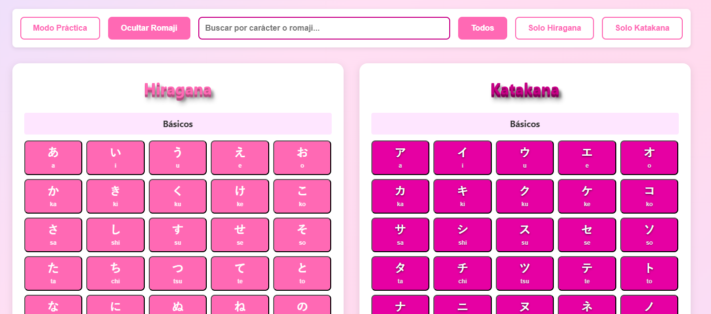

# Japanese Alphabet - Hiragana & Katakana

Aplicación web estática interactiva para aprender y practicar los silabarios japoneses Hiragana y Katakana. Una herramienta educativa con un diseño visual atractivo que facilita el aprendizaje de los caracteres japoneses.

## 📸 Captura de Pantalla



*Interfaz principal mostrando los silabarios Hiragana y Katakana con controles interactivos*

## 📋 Descripción

Esta aplicación web proporciona una interfaz visual e interactiva para estudiar los dos silabarios principales del idioma japonés:

- **Hiragana**: Silabario utilizado principalmente para palabras de origen japonés y gramática
- **Katakana**: Silabario utilizado para palabras extranjeras, nombres propios y onomatopeyas

Cada carácter se muestra junto con su transliteración (romaji) para facilitar el aprendizaje.

## 🚀 Características

- ✅ Visualización completa de los silabarios Hiragana y Katakana
- ✅ Transliteración (romaji) para cada carácter
- ✅ **Modo Práctica**: Oculta caracteres para practicar y memorizar
- ✅ **Búsqueda en tiempo real**: Busca por carácter o romaji
- ✅ **Filtros**: Muestra solo Hiragana, solo Katakana o ambos
- ✅ **Organización por filas**: Caracteres agrupados por sonidos (a-i-u-e-o, ka-ki-ku-ke-ko, etc.)
- ✅ Diseño visual atractivo con colores distintivos y degradado de fondo
- ✅ Información educativa sobre los sistemas de escritura japonesa
- ✅ Interfaz responsive y fácil de usar
- ✅ Fuentes personalizadas para una mejor visualización
- ✅ Accesibilidad mejorada con navegación por teclado

## 📁 Estructura del Proyecto

```
japanese-keys/
├── index.html          # Página principal con los silabarios
├── stylesheet.css      # Estilos personalizados
├── app.js             # Lógica de la aplicación y datos embebidos
├── README.md          # Este archivo
├── Cabecera.png       # Imagen de cabecera
└── fonts/             # Fuentes personalizadas
    ├── japonesa-webfont.woff
    └── japonesa-webfont.woff2
```

## 🛠️ Tecnologías Utilizadas

- **HTML5**: Estructura semántica moderna de la aplicación
- **CSS3**: Estilos modernos con Grid, Flexbox y variables CSS
- **JavaScript (ES6+)**: Interactividad y generación dinámica de contenido
- **Fuentes personalizadas**: Para una mejor visualización de caracteres japoneses

## 📚 Sistemas de Escritura Japonesa

El idioma japonés utiliza tres sistemas de escritura:

1. **Kanji (漢字)**: Caracteres de origen chino que representan la mayoría del vocabulario
2. **Hiragana (ひらがな)**: Silabario utilizado para palabras de origen japonés y gramática
3. **Katakana (カタカナ)**: Silabario utilizado para palabras extranjeras y onomatopeyas

Hiragana y Katakana son equivalentes fonéticamente, pero tienen usos distintos en la escritura japonesa.

## 🚀 Uso

### Opción 1: Abrir directamente

1. Clona o descarga el repositorio:
```bash
git clone https://github.com/Makishima09/japanese-keys.git
cd japanese-keys
```

2. Abre `index.html` en tu navegador web preferido

### Opción 2: Servidor local

Para una mejor experiencia, puedes usar un servidor local:

```bash
# Con Python 3
python -m http.server 8000

# Con Node.js (http-server)
npx http-server

# Con PHP
php -S localhost:8000
```

Luego abre `http://localhost:8000` en tu navegador.

## 🎨 Características Visuales

- **Colores distintivos**: 
  - Hiragana: Rosa/Hotpink (#ff69b4)
  - Katakana: Magenta oscuro (#c80087)
- **Fondo degradado**: Degradado suave de azul claro a rosa/púrpura
- **Efectos de texto**: Sombras y relieves 3D para mejor legibilidad
- **Diseño responsive**: Adaptable a diferentes tamaños de pantalla (mobile-first)
- **Efecto Bento**: Caracteres organizados en filas que llenan todo el ancho disponible

## 📖 Contenido Educativo

La aplicación incluye información sobre:
- Los tres sistemas de escritura japonesa
- Diferencias entre Hiragana y Katakana
- Uso apropiado de cada silabario
- Caracteres básicos y combinaciones (dakuten, handakuten, combinaciones con "y")

## 🔧 Personalización

Puedes personalizar la aplicación modificando:
- `stylesheet.css`: Colores, fuentes y estilos
- `index.html`: Contenido y estructura
- Agregar más funcionalidades como ejercicios interactivos

## 📝 Changelog

### Update 2025

#### 🎉 Mejoras Principales

- **Refactorización completa del código**
  - Separación de CSS del HTML (archivo externo `stylesheet.css`)
  - Implementación de JavaScript modular (`app.js`)
  - Datos embebidos en JavaScript (sin necesidad de servidor)

- **Nuevas funcionalidades interactivas**
  - ✨ **Modo Práctica**: Oculta caracteres japoneses y romaji para practicar memorización
  - 🔍 **Búsqueda en tiempo real**: Busca caracteres por su forma o pronunciación (romaji)
  - 🎯 **Filtros**: Muestra solo Hiragana, solo Katakana o ambos silabarios
  - 👁️ **Toggle Romaji**: Muestra u oculta la transliteración

- **Mejoras de diseño y UX**
  - 🎨 Fondo degradado moderno (azul claro a rosa/púrpura)
  - 📐 Organización por filas de sonidos (efecto Bento)
  - 🎯 Mejor contraste en títulos y caracteres
  - 📱 Diseño responsive mejorado con CSS Grid y Flexbox
  - ✨ Animaciones suaves en modo práctica

- **Mejoras técnicas**
  - ♿ Accesibilidad mejorada (aria-labels, navegación por teclado)
  - 🏗️ Estructura HTML5 semántica moderna
  - 📦 Meta tags SEO y Open Graph
  - 🧹 Limpieza de archivos no utilizados
  - 🎨 Variables CSS para fácil personalización

- **Correcciones**
  - 🐛 Corregido carácter incorrecto en Hiragana (ほ para "ho")
  - 🐛 Corregido contraste en modo práctica
  - 🐛 Mejorado contraste de títulos Katakana

#### 📊 Estadísticas

- **Archivos nuevos**: 1 (`app.js`)
- **Archivos modificados**: 2 (`index.html`, `stylesheet.css`)
- **Archivos eliminados**: 6 (archivos no utilizados)
- **Líneas de código**: ~500+ líneas de JavaScript añadidas

---

## 📝 Notas

- Esta aplicación está en continuo desarrollo
- Las sugerencias y mejoras son bienvenidas
- Ideal para estudiantes principiantes de japonés

## 🤝 Contribuciones

Las contribuciones son bienvenidas. Si deseas mejorar este proyecto:

1. Haz un fork del repositorio
2. Crea una rama para tu feature (`git checkout -b feature/AmazingFeature`)
3. Commit tus cambios (`git commit -m 'Add some AmazingFeature'`)
4. Push a la rama (`git push origin feature/AmazingFeature`)
5. Abre un Pull Request

## 📄 Licencia

Este proyecto es de código abierto y está disponible para uso educativo y de aprendizaje.

## 👤 Autor

**Makishima09**

- GitHub: [@Makishima09](https://github.com/Makishima09)

## 🙏 Agradecimientos

- A la comunidad de aprendizaje de japonés
- A todos los que contribuyen al proyecto

---

ありがとうございました！ (¡Gracias!)

⭐ Si este proyecto te resulta útil, ¡no olvides darle una estrella!
